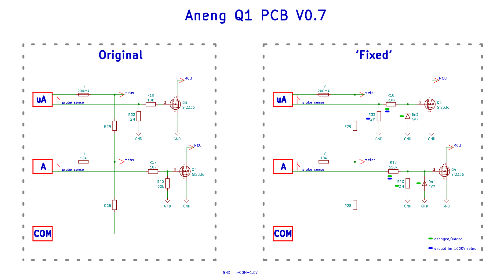

# Aneng Q1 fix
Hardware fix for Aneng Q1 V0.7.

Q4 and Q5 transistors could be damaged by:
- Blown fuse when measuring current in circuits >30V.
- Disconnecting probe from current sockets of the meter (A, uA) during current measurement.
- ESD.

Simpler repair of already broken meter: Replace Q4/Q5 with Si2336 (Gate threshold 1.5-1.8V).

(Aneng SZ02 has similar probe sensing circuit, but R_base_series = 100k)

